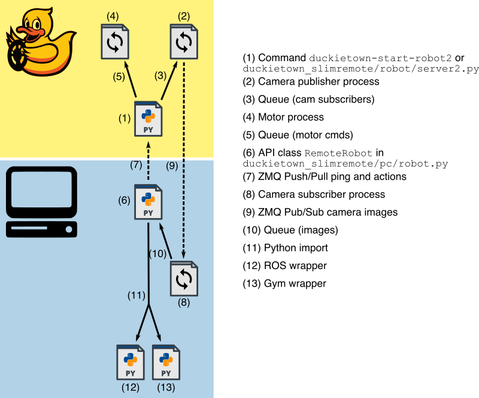

## Install

**On the robot:**

First you need to compile the most recent version of OpenCV: https://raspberrypi.stackexchange.com/questions/69169/how-to-install-opencv-on-raspberry-pi-3-in-raspbian-jessie

After that clone and install the repo

    git clone https://github.com/duckietown/duckietown-slimremote.git
    
    cd duckietown-slimremote
    
    sudo pip3 install -e . # install in developer mode
    
Once the repo is installed you can start the robot controller with this command:

    duckietown-start-robot2
    
You quit the robot controller via <kbd>CTRL</kbd>+<kbd>c</kbd>. But the controller should always be running in the background.
    
    
**On the PC:**

Same clone and install procedure as on the robot, but the OpenCV version is not important and the standard platform version should be fine (e.g. on mac that would be `brew install opencv3 --with-contrib --with-python3 --without-python` for Python 3 bindings). 

Afterwards you can run

    python3 tests/12-test-keyboard-controller.py
    
...to get a keyboard controller window that displays the robot's camera and in which you can control the robot via the arrow keys (up/down/left/right)

## API

The main remote control class is 

    duckietown_slimremote.pc.robot.RemoteRobot
    
There you can find the methods:

**step(action, with_observation=True)**:
 Executes a single motor command. Action but be either tuple, list, or numpy array of two elements. Return an observation that is an RGB image unless `with_observation = False` in the shape (160,128,3). This is blocking and the call frequency is limited to the image observation frequency which is currently capped to 60Hz.
 
**observe()**:
 Returns the last seen observation (RGB image, identical to `step`). This is blocking and similarly to `step` currently capped at 60Hz.
 
**reset()**:
 Stops the robot (sends a `[0,0]` action).
d

## Communication & Architecture

 

    

